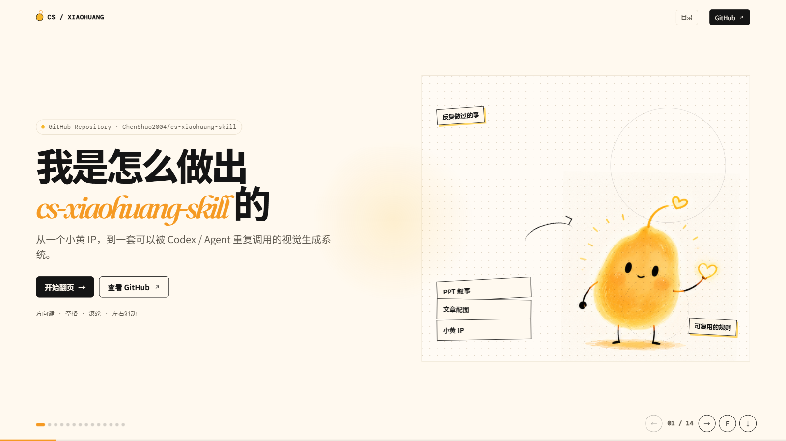

# CS 小黄内容与产品表达

> 围绕同一个小黄，把内容和产品表达拆成四种可直接交付的能力：小黄 PPT 页面、文章配图、网页幻灯片与 PPTX 网页化、产品宣传视频。小黄 IP 延展保留为 `cs-xiaohuang-skill` 的基础能力，用来守住静态视觉表达的一致性。
>
> 当前工作流由三项 Codex skills 组成：
>
> | Skill | 用途 | 默认交付 |
> | --- | --- | --- |
> | `cs-xiaohuang-skill` | 小黄品牌 IP、轻手绘 PPT 页面与文章配图 | PNG 图片、blueprint / shot list、contact sheet |
> | `cs-shotcraft-skill` | 产品宣传视频；可将小黄资产融入产品叙事 | 分镜、Remotion 成片、带 / 不带 BGM 版本 |
> | `cs-web-slides` | 可翻页网页幻灯片与 PPTX 网页化 | 16:9 HTML 演示、键盘 / 触控导航 |

## 交互式 PPT Demo

> 想快速理解这个 Skill 是怎样从「一次性 Prompt」演化为可复用工作流的？打开这套 14 页交互式教程。

<p align="center">
  
</p>

<p align="center">
  <a href="xiaohuang-skill-tutorial/"><strong>查看 Demo 文件</strong></a>
  &nbsp;·&nbsp;
  <a href="xiaohuang-skill-tutorial/index.html"><strong>查看 HTML 源文件</strong></a>
</p>

克隆仓库后，直接用浏览器打开 `xiaohuang-skill-tutorial/index.html` 即可体验完整互动版本：支持方向键、空格、滚轮、触控滑动翻页；按 <kbd>E</kbd> 可直接修改文案，点击下载按钮即可保存编辑后的 HTML。

## 这是什么

这不是一个单纯的 PPT 模板或角色提示词，而是一套把内容、角色资产和产品叙事接起来的视觉工作流。`cs-xiaohuang-skill` 负责小黄身份与静态内容表达；当表达需要进入产品宣传片时，`cs-shotcraft-skill` 负责镜头、动效、声音和成片交付。

小黄始终是“有温度”的固定品牌角色：它会筛选、连接、修复、点亮或搬运，帮用户看懂最关键的判断、关系与转折，而不是在画面角落卖萌。

## 四种核心能力

先看你要解决什么，再选能力。提供内容、用途和已有素材即可；不需要先写复杂提示词。

| 能力（负责 Skill） | 最适合的任务与输入 | 默认交付 |
| --- | --- | --- |
| **小黄 PPT 页面**<br>`cs-xiaohuang-skill` | 用课程提纲、分享主题、产品说明、工作流或文章，讲清一条完整逻辑 | 先给逐页 `slide blueprint`，再交付 5–12 张 16:9 PNG 页面和整套 `contact sheet` |
| **文章封面与配图**<br>`cs-xiaohuang-skill` | 用公众号、博客、Newsletter、Notion 或知识长文，把关键判断、关系和转折画出来 | 1 张 21:9 封面 + 3–6 张 16:9 正文图，并附 `shot list` 和 `contact sheet` |
| **网页幻灯片**<br>`cs-web-slides` | 要在浏览器里一页一页讲：课程、演讲、路演、产品发布；或把已有 PPT / PPTX 做成可分享的网页演示 | 先给 3 个真实封面方向；确认后交付可翻页的 16:9 `index.html` 与 `assets/`，支持键盘 / 触控 / 进度条和浏览器内改字 |
| **产品宣传视频**<br>`cs-shotcraft-skill` | 用本地产品项目、线上网址、录屏或截图，把功能与品牌价值讲成一支短片 | 产品检查、镜头映射、分镜、Remotion 成片；带 BGM 与不带 BGM 两版，按需导出剪映工程 |

**怎么选：**要完整讲清一条逻辑、交付图片课件，选“小黄 PPT 页面”；已有文章、希望提升阅读理解，选“文章封面与配图”；要现场演示、在浏览器播放，或把 PPTX 网页化，选“网页幻灯片”；要把产品功能做成有镜头、节奏和声音的发布片，选“产品宣传视频”。

小黄 PPT 交付的是静态 PNG 页面；网页幻灯片交付的是可翻页的 HTML 演示。两者都和“PPT”有关，但一个是图，一个是现场用的 deck。

小黄 IP 是静态视觉能力的共同基础，而不是需要先选的第三条路径：**动作、场景、媒介和画法可以变，角色身份不能变。**内容型交付还遵守两条质量线：一张图只解释一个核心关系；小黄必须完成解释动作，不能只是角落装饰。产品视频默认以真实产品页面为主角；需要小黄时，将已验收的角色资产作为叙事元素融入镜头。

## 静态小黄内容如何工作

```text
原始素材
   ↓
内容 intake：主题、受众、目标、核心判断
   ↓
Deck：叙事与逐页 blueprint     文章：认知锚点与 shot list
   ↓                                      ↓
语义构图：对比 / 转化 / 筛选 / 阻塞 / 循环 / 分叉 / 搭建
   ↓
锁定小黄身份与整套视觉语言
   ↓
逐张生成 PNG → 检查中文、比例、角色与风格 → contact sheet → 交付
```

具体过程是：

1. 从素材中提炼必须让读者理解的主线。
2. 为每一页选择合适的语义版式，而不是重复套版。
3. 锁定暖白底、黑色轻手绘线条、小黄 DNA 与跨页留白；deck 额外锁定标题与页码位置。
4. 逐张生成完整 PNG，并用 contact sheet 检查整套一致性。

### 网页幻灯片如何工作

```text
课程 / 演讲 / 路演素材，或现有 PPTX
   ↓
读取内容、品牌资产与演示场景
   ↓
新建：3 个真实封面方向 → 用户选定方向
转换：提取 PPTX 内容与图片 → 确认保留项
   ↓
逐页大纲 → 固定 16:9 舞台 → 导航、动效与浏览器内编辑
   ↓
检查桌面与窄屏适配、键盘 / 触控导航、图片与品牌资产
   ↓
交付 `index.html` + `assets/`
```

### 产品视频如何工作

```text
产品项目 / 线上网址 / 录屏 / 页面截图
   ↓
最小只读产品检查：定位、功能、页面视觉与素材风险
   ↓
选择 Ink Press 模板 / 自主自由创作 / 共同创作
   ↓
视觉方向 → 功能到镜头映射 → 完整分镜 → 真实页面素材采集
   ↓
Remotion 动效、转场、SFX 与节奏卡点 → 渲染与独立 QA
   ↓
成片交付：带 BGM 版 + 不带 BGM 版；需要时导出剪映工程
```

产品视频不把静态页面简单拼起来：镜头结构、字体、色彩和动效应从目标产品自身的设计系统生长。需要小黄出场时，先用 `cs-xiaohuang-skill` 产出合格资产，再由 `cs-shotcraft-skill` 安排其在镜头中的动作与作用。

## 适合谁用

- 想把文章、公众号、博客、Newsletter 或 Notion 做成小黄封面与正文配图的人。
- 想把文章、公众号、Notion 或课程提纲变成小黄风格课件的人。
- 想将课程、演讲、路演、产品发布内容做成可交互网页幻灯片，或将现有 PPTX 网页化的人。
- 需要一套有固定角色人格的产品介绍、工作流说明或知识内容的人。
- 希望 AI 先想清楚“每一页讲什么”，再生成视觉页面的人。
- 需要图片型小黄课件，或可在浏览器直接播放、编辑和分享的网页演示的人。
- 希望把真实产品页面、功能价值和品牌调性做成发布视频、功能演示或产品特写的人。

小黄 IP 的标准图、动作、表情、三视图、2D / 3D、联名与身份修复，也仍可直接用 `cs-xiaohuang-skill` 生成；它服务于角色一致性，不再与“演示方式”并列。

不适合：原生可编辑 PPTX、复杂架构图、数据仪表盘、密集表格、逐字讲稿。产品视频能力也不替代纪录片、真人口播或长篇泛剪辑工作流。

## 默认产出

- 小黄 PPT：5–12 张 16:9 PNG 标准页面（推荐 1920×1080）
- 文章配图：1 张 21:9 封面（推荐 2520×1080）与 3–6 张 16:9 正文图
- 网页幻灯片：3 个真实封面方向（新建时）→ 可翻页的 16:9 `index.html` 与 `assets/`，支持键盘、触控、进度、浏览器内文字编辑与下载修改版本
- 多页 contact sheet
- deck 的简短 slide-by-slide blueprint，或文章的 shot list
- 产品视频：产品检查、镜头映射、完整分镜与 Remotion 成片；默认交付带 BGM 与不带 BGM 两版，剪映工程按需导出

品牌 IP 延展按用途交付标准图、动作 / 表情、三视图、2D / 3D 或修复资产。`cs-xiaohuang-skill` 的静态内容默认不产出可编辑 PPTX、图片型 PPTX、PDF、HTML、SVG、Canvas 或程序化矢量图；需要可交互 HTML 时用 `cs-web-slides`。
## 小黄的视觉 DNA

小黄是“有温度”的固定角色，而不是通用黄色卡通：暖黄色、不规则、微倾斜的种子形身体，顶部细弯天线末端是空心暖橙爱心，黑色竖椭圆眼、腮红和细黑四肢。

整套 PPT 使用暖白背景、自然轻微抖动的黑色手绘线、克制的红橙/蓝色状态标记和大量留白。小黄必须完成画面中关键的解释动作，不能只是角落装饰。


## 示例效果

这些示例用于校准小黄的身份、留白与“用动作解释概念”的方式。真正生成 deck 时，每页会按语义重新选择构图，不复制既有画面。

| 一个核心动作 | 把关系画出来 | 抽象变成看得见 |
| --- | --- | --- |
|  |  |  |

## 安装

下载或克隆本仓库后，进入仓库根目录，将需要的 skill 安装到 Codex skills 目录：

```bash
git clone https://github.com/ChenShuo2004/cs-xiaohuang-skill.git
cd cs-xiaohuang-skill
mkdir -p "${CODEX_HOME:-$HOME/.codex}/skills"
cp -R ./cs-xiaohuang-skill "${CODEX_HOME:-$HOME/.codex}/skills/"
cp -R ./cs-web-slides "${CODEX_HOME:-$HOME/.codex}/skills/"
```

Windows PowerShell：

```powershell
git clone https://github.com/ChenShuo2004/cs-xiaohuang-skill.git
Set-Location .\cs-xiaohuang-skill
Copy-Item -Recurse .\cs-xiaohuang-skill "$env:USERPROFILE\.codex\skills\cs-xiaohuang-skill"
Copy-Item -Recurse .\cs-web-slides "$env:USERPROFILE\.codex\skills\cs-web-slides"
```

产品宣传视频由配套的 `cs-shotcraft-skill` 提供，需要单独安装；其上游能力库见 [video-shotcraft](https://github.com/Vincentwei1021/video-shotcraft)。本机已安装后，可直接用 `$cs-shotcraft-skill` 调用。

## 怎么用

### 网页幻灯片（第三种能力）

第三种能力是真正的幻灯片：在浏览器里一页一页讲，而不是生成一套 PNG 图片。知识课程、路演、产品发布，或已有 PPT / PPTX，都交给 `cs-web-slides`。它交付带导航、动效和浏览器内编辑能力的 16:9 HTML 演示。

知识课程可直接这样调用：

~~~text
Use $cs-web-slides 把下面课程做成 12 页知识型网页幻灯片。
受众是刚入门的中文学习者；先给我笔记手帐、杂志静奢、果冻多巴胺三个真实封面方向，再按我选择的方向完成整套 deck。

<粘贴课程素材>
~~~

内置课程风格库：笔记手帐、粗粝手作、果冻多巴胺、杂志静奢、像素未来、液态玻璃。可先打开 `cs-web-slides/assets/course-style-gallery.html` 查看方向。

通用网页演示也可这样调用：

~~~text
Use $cs-web-slides 将下面内容制作成精美、可交互的网页幻灯片。
用于一场产品发布，面向潜在客户，偏低密度演讲节奏；保留 logo 与产品截图。
先生成三个真实封面视觉方向供我选择，确认后再完成整套 HTML 演示。

<粘贴内容>
~~~

已有 PPTX 时：

~~~text
Use $cs-web-slides 把附件 PPTX 转换为网页演示。
保留原始图片、产品截图和品牌素材；先提取并确认逐页内容，再给我三个视觉方向。
~~~

它输出固定 16:9 舞台的 HTML，支持键盘、触控、悬停交互、动画与浏览器内文本编辑；不输出原生可编辑 PPTX，也不输出小黄风格的静态 PNG 课件。需要图片型小黄课件时，改用 `cs-xiaohuang-skill` 的“小黄 PPT 页面”。

### 产品宣传视频（第四种能力）

有本地项目、线上网址、录屏或页面截图时，直接交给 `cs-shotcraft-skill`：

```text
Use $cs-shotcraft-skill 为我的产品制作一支 30 秒发布视频。
产品是 <产品名称>，核心要展示 <功能 / 用户价值>。
素材在 <项目路径 / 网址 / 截图>；视觉延续产品现有设计系统。
先做最小产品检查并推荐制作模式；我确认后再进入成片制作。
```

产品本身始终是视频主角，小黄不是强制装饰。需要小黄参与时，可以在同一条需求中明确其作用：

```text
先用 $cs-xiaohuang-skill 为这次发布准备小黄资产，
再用 $cs-shotcraft-skill 将它作为解释 <关键关系> 的角色融入产品宣传视频。
```

### 文章变成一套小黄课件图

```text
Use $cs-xiaohuang-skill 把下面文章做成 10 页小黄轻手绘 PPT-style 页面图。
面向刚接触这个主题的中文读者；先给 slide blueprint，再逐页生成 16:9 PNG 和 contact sheet。
小黄必须承担解释关键关系的动作，文字保持短。

<粘贴文章>
```

适合的文章结构包括：一个反常识判断、前后变化、输入与转化、流程中的卡点、反馈回路、分叉选择或一条值得带走的结论。

### 文章封面与正文配图

```text
Use $cs-xiaohuang-skill 为下面文章生成 1 张 21:9 封面图和 4 张 16:9 正文配图。
先识别最值得被理解的认知锚点并输出 shot list；每张图只解释一个关系。
正文配图默认不要页码或 PPT 标题，小黄必须完成关键动作；最后输出 contact sheet。

<粘贴文章>
```

### 产品或工作流说明

```text
Use $cs-xiaohuang-skill 将这个产品工作流做成 8 页小黄 PPT 图。
目标是让潜在用户理解：旧方法卡在哪里、系统如何处理、最终获得什么。
先规划叙事；不要做可编辑 PPTX，不要使用卡片墙或正式流程图。

<粘贴素材>
```

### 只要规划，不生成图片

```text
Use $cs-xiaohuang-skill 先不要生图。
把下面内容规划为一套 6 页左右的小黄 PPT-style deck。
逐页给出标题、主旨、archetype、小黄动作、可见中文和图像 brief。

<粘贴素材>
```

### 小黄品牌 IP 延展（基础能力）

```text
Use $cs-xiaohuang-skill 基于小黄身份参考图，生成一张保持暖黄种子轮廓、空心爱心天线和细黑四肢的 3D 软胶角色图。
只转换材质、体积和光线，不重新设计角色；暖白背景，无文字或水印。
```

更多提示词可见 [examples/prompts.md](examples/prompts.md)。

## 工作流

1. 读取素材并判断受众、目标、核心论点与素材充分度。
2. 选择教学、说服、产品解释、复盘或知识卡片叙事。
3. 做 deck 时用语义选择“对比、转化、筛选、阻塞、分叉、循环、搭建、总结”等页面结构；做文章时先从全文挑出 3–6 个认知锚点。
4. 锁定同一套角色身份、画布、线条、颜色与留白；deck 固定标题和页码，文章正文图默认不使用它们。
5. 为每页 / 每张图输出精准的图像 brief 和 `Required text only`。
6. 逐张生成并校验：中文、比例、身份、构图和风格。
7. 生成 contact sheet，修复不一致页面或配图后交付。

## 输出边界

`cs-xiaohuang-skill` 聚焦小黄品牌资产、PPT 页面与文章配图，不输出：

- 可编辑 PPTX、图片型 PPTX 或 PDF。
- 复杂系统架构图、数据仪表盘、密集表格或正式流程图。
- 长段正文、逐字讲稿、代码块、真实 UI 或复杂动效。

若需要可编辑演示文稿，请使用专门的 Presentation / PowerPoint 工作流；需要可交互 HTML 时使用 `cs-web-slides`；需要产品视频时使用 `cs-shotcraft-skill`。品牌 IP 延展是 `cs-xiaohuang-skill` 的内置能力；角色 DNA 始终优先于场景、媒介和画风。

## 目录结构

```text
.
├── README.md
├── LICENSE
├── NOTICE.md
├── examples/
│   ├── images/
│   └── prompts.md
├── cs-xiaohuang-skill/             # 安装此目录
    ├── SKILL.md
    ├── agents/openai.yaml
    ├── assets/
    │   ├── reference-xiaohuang.png
    │   └── theme-tokens.json
    └── references/
        ├── character-dna.md
        ├── media-and-variants.md
        ├── ip-prompt-templates.md
        ├── article-illustrations.md
        ├── intake.md
        ├── narrative-planning.md
        ├── output-quality.md
        ├── prompt-patterns.md
        ├── slide-archetypes.md
        └── visual-dna.md
└── cs-web-slides/                   # 安装此目录
    ├── SKILL.md
    ├── agents/openai.yaml
    ├── assets/
    │   ├── web-slide-starter.html
    │   └── course-style-gallery.html
    ├── references/
    │   ├── style-index.md
    │   └── styles/
    └── scripts/extract-pptx.ps1
```

## 注意事项

- 图片模型最容易在中文长文字上出错；标题与标签越短越稳定。
- 多页创作不能只复用一个构图。保持同一母版，改变中间的语义动作与物件。
- 小黄的天线、空心爱心、种子轮廓和细黑四肢是身份锚点；两个以上锚点出错时，应重做而非将错就错。
- 生成图片模型可能出现错字、虚假标签或物件关系错误。请在 contact sheet 之外逐页查看最终图。

## 致谢

本仓库的“内容 intake → 叙事 → 页面 archetype → 风格锁定 → 逐页提示词 → 交付 QA”结构，参考了 [Ian Handdrawn PPT](https://github.com/helloianneo/ian-handdrawn-ppt) 的公开工作流思路；没有复制其图片素材或其视觉风格。小黄角色、视觉 DNA 与原始品牌资产来自 [CS Skills](https://github.com/ChenShuo2004/cs-skills)。

## License

MIT License，见 [LICENSE](LICENSE)。小黄形象与品牌相关使用请遵守品牌方的授权和使用规范。

