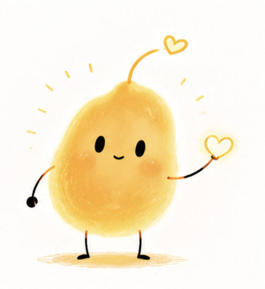
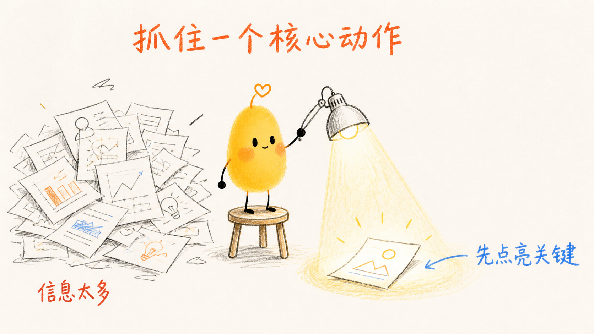
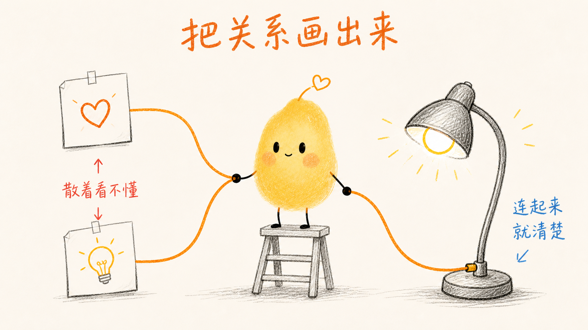

# CS 小黄 IP、PPT 配图与网页幻灯片

> 用同一个小黄，把文章、课程笔记、产品说明或一个想法，变成可直接发布的中文轻手绘图片；也能把内容或现有 PPTX 做成可交互的网页幻灯片。
>
> 本仓库提供两项独立的 Codex skills：
>
> | Skill | 用途 | 默认交付 |
> | --- | --- | --- |
> | `cs-xiaohuang-skill` | 小黄品牌 IP、轻手绘 PPT-style 图与文章配图 | PNG 图片、blueprint、contact sheet |
> | `cs-web-slides` | 高品质网页幻灯片与 PPTX 网页化 | HTML 演示目录、原始图片资产 |

## 这是什么

`cs-xiaohuang-skill` 是小黄（有温度）的统一 Codex Skill。它既能生成、编辑和延展小黄品牌 IP，也会先理解内容：做演示时建立叙事和逐页 blueprint；做文章时识别认知锚点并输出 shot list。之后将资产、页面或配图逐张生成可直接交付的图片。

它不是传统 PPT 模板，也不是可编辑 PPTX 生成器。它的核心是让固定品牌角色“小黄”通过筛选、连接、修复、点亮、搬运等动作，解释内容中最关键的判断、关系与转折。

## 三种输出模式

| 模式 | 适合场景 | 默认交付 |
| --- | --- | --- |
| 小黄 PPT | 课程、分享、产品说明、工作流、方法论 | 5–12 张 16:9 PNG 页面 + slide blueprint + contact sheet |
| 文章配图 | 公众号、博客、Newsletter、Notion、知识型长文 | 1 张 21:9 封面 + 3–6 张 16:9 正文图 + shot list + contact sheet |
| 品牌 IP 延展 | 标准图、动作表情、三视图、2D / 3D、联名、风格迁移、身份修复 | 保持身份一致的单张或多张品牌资产 |

所有模式都遵守同一条原则：**可以换动作、场景、媒介和画法；不可以换掉小黄身份。**内容模式中，一张图只解释一个关系，小黄必须完成关键动作，不能只在角落卖萌。

## 它如何工作

```text
原始素材
   ↓
内容 intake：主题、受众、目标、核心判断
   ↓
Deck：叙事与逐页 blueprint     文章：认知锚点与 shot list     IP：身份锚点与变量
   ↓                                      ↓
语义构图：对比 / 转化 / 筛选 / 阻塞 / 循环 / 分叉 / 搭建
   ↓
锁定小黄身份与整套视觉语言
   ↓
逐张生成 PNG → 检查中文、比例、角色与风格 → contact sheet → 交付
```

具体过程是：

1. 从素材中提炼必须让读者理解的主线。
2. 为每一页选择合适的语义版式，而不是重复套版。
3. 锁定暖白底、黑色轻手绘线条、小黄 DNA 与跨页留白；deck 额外锁定标题与页码位置。
4. 逐张生成完整 PNG，并用 contact sheet 检查整套一致性。

## 适合谁用

- 需要稳定生成、修改或延展小黄标准图、动作、表情、三视图、2D / 3D、联名与场景资产的人。
- 想把文章、公众号、博客、Newsletter 或 Notion 做成小黄封面与正文配图的人。
- 想把文章、公众号、Notion 或课程提纲变成小黄风格课件的人。
- 需要一套有固定角色人格的产品介绍、工作流说明或知识内容的人。
- 希望 AI 先想清楚“每一页讲什么”，再生成视觉页面的人。
- 需要可快速审阅和发布的图片型演示稿，而不是可编辑的 PowerPoint 文件的人。

不适合：可编辑 PPTX、复杂架构图、数据仪表盘、密集表格、逐字讲稿，或需要复杂动效与交互的内容。

## 默认产出

- 小黄 PPT：5–12 张 16:9 PNG 标准页面（推荐 1920×1080）
- 文章配图：1 张 21:9 封面（推荐 2520×1080）与 3–6 张 16:9 正文图
- 品牌 IP：用户指定用途、媒介和尺寸的标准图、动作 / 表情、三视图、2D / 3D 或修复资产
- 多页 contact sheet
- deck 的简短 slide-by-slide blueprint，或文章的 shot list

默认不产出：可编辑 PPTX、图片型 PPTX、PDF、HTML、SVG、Canvas 或程序化矢量图。

## 小黄的视觉 DNA

小黄是“有温度”的固定角色，而不是通用黄色卡通：暖黄色、不规则、微倾斜的种子形身体，顶部细弯天线末端是空心暖橙爱心，黑色竖椭圆眼、腮红和细黑四肢。

整套 PPT 使用暖白背景、自然轻微抖动的黑色手绘线、克制的红橙/蓝色状态标记和大量留白。小黄必须完成画面中关键的解释动作，不能只是角落装饰。



## 示例效果

这些示例用于校准小黄的身份、留白与“用动作解释概念”的方式。真正生成 deck 时，每页会按语义重新选择构图，不复制既有画面。

| 一个核心动作 | 把关系画出来 | 抽象变成看得见 |
| --- | --- | --- |
|  |  |  |

## 安装

下载或克隆本仓库后，进入仓库根目录，将需要的 skill 安装到 Codex skills 目录：

```bash
git clone https://github.com/ChenShuo2004/cs-xiaohuang-skill.git
cd cs-xiaohuang-skill
mkdir -p "${CODEX_HOME:-$HOME/.codex}/skills"
cp -R ./cs-xiaohuang-skill "${CODEX_HOME:-$HOME/.codex}/skills/"
cp -R ./cs-web-slides "${CODEX_HOME:-$HOME/.codex}/skills/"
```

Windows PowerShell：

```powershell
git clone https://github.com/ChenShuo2004/cs-xiaohuang-skill.git
Set-Location .\cs-xiaohuang-skill
Copy-Item -Recurse .\cs-xiaohuang-skill "$env:USERPROFILE\.codex\skills\cs-xiaohuang-skill"
Copy-Item -Recurse .\cs-web-slides "$env:USERPROFILE\.codex\skills\cs-web-slides"
```

## 怎么用

### 网页幻灯片与 PPTX 网页化

知识课程可直接这样调用：

~~~text
Use $cs-web-slides 把下面课程做成 12 页知识型网页幻灯片。
受众是刚入门的中文学习者；先给我 笔记手帐、杂志静奢、果冻多巴胺 三个真实封面方向，再按我选择的方向完成整套 deck。

<粘贴课程素材>
~~~

内置课程风格库：笔记手帐、粗粝手作、果冻多巴胺、杂志静奢、像素未来、液态玻璃。可先打开 `cs-web-slides/assets/course-style-gallery.html` 查看方向。

通用网页演示也可这样调用：

~~~text
Use $cs-web-slides 将下面内容制作成精美、可交互的网页幻灯片。
用于一场产品发布，面向潜在客户，偏低密度演讲节奏；保留 logo 与产品截图。
先生成三个真实封面视觉方向供我选择，确认后再完成整套 HTML 演示。

<粘贴内容>
~~~

已有 PPTX 时：

~~~text
Use $cs-web-slides 把附件 PPTX 转换为网页演示。
保留原始图片、产品截图和品牌素材；先提取并确认逐页内容，再给我三个视觉方向。
~~~

它输出的是固定 16:9 舞台的 HTML，支持键盘、触控、悬停交互、动画与浏览器内文本编辑。需要静态图片型小黄课件时，继续使用下面的小黄工作流。

### 文章变成一套小黄课件图

```text
Use $cs-xiaohuang-skill 把下面文章做成 10 页小黄轻手绘 PPT-style 页面图。
面向刚接触这个主题的中文读者；先给 slide blueprint，再逐页生成 16:9 PNG 和 contact sheet。
小黄必须承担解释关键关系的动作，文字保持短。

<粘贴文章>
```

适合的文章结构包括：一个反常识判断、前后变化、输入与转化、流程中的卡点、反馈回路、分叉选择或一条值得带走的结论。

### 文章封面与正文配图

```text
Use $cs-xiaohuang-skill 为下面文章生成 1 张 21:9 封面图和 4 张 16:9 正文配图。
先识别最值得被理解的认知锚点并输出 shot list；每张图只解释一个关系。
正文配图默认不要页码或 PPT 标题，小黄必须完成关键动作；最后输出 contact sheet。

<粘贴文章>
```

### 产品或工作流说明

```text
Use $cs-xiaohuang-skill 将这个产品工作流做成 8 页小黄 PPT 图。
目标是让潜在用户理解：旧方法卡在哪里、系统如何处理、最终获得什么。
先规划叙事；不要做可编辑 PPTX，不要使用卡片墙或正式流程图。

<粘贴素材>
```

### 只要规划，不生成图片

```text
Use $cs-xiaohuang-skill 先不要生图。
把下面内容规划为一套 6 页左右的小黄 PPT-style deck。
逐页给出标题、主旨、archetype、小黄动作、可见中文和图像 brief。

<粘贴素材>
```

### 小黄品牌 IP 延展

```text
Use $cs-xiaohuang-skill 基于小黄身份参考图，生成一张保持暖黄种子轮廓、空心爱心天线和细黑四肢的 3D 软胶角色图。
只转换材质、体积和光线，不重新设计角色；暖白背景，无文字或水印。
```

更多提示词可见 [examples/prompts.md](examples/prompts.md)。

## 工作流

1. 读取素材并判断受众、目标、核心论点与素材充分度。
2. 选择教学、说服、产品解释、复盘或知识卡片叙事。
3. 做 deck 时用语义选择“对比、转化、筛选、阻塞、分叉、循环、搭建、总结”等页面结构；做文章时先从全文挑出 3–6 个认知锚点。
4. 锁定同一套角色身份、画布、线条、颜色与留白；deck 固定标题和页码，文章正文图默认不使用它们。
5. 为每页 / 每张图输出精准的图像 brief 和 `Required text only`。
6. 逐张生成并校验：中文、比例、身份、构图和风格。
7. 生成 contact sheet，修复不一致页面或配图后交付。

## 输出边界

这个 skill 输出的是完整 PNG 页面图，并不输出：

- 可编辑 PPTX、图片型 PPTX 或 PDF。
- 复杂系统架构图、数据仪表盘、密集表格或正式流程图。
- 长段正文、逐字讲稿、代码块、真实 UI 或复杂动效。

若需要可编辑演示文稿，请使用专门的 Presentation / PowerPoint 工作流。品牌 IP 延展是本 skill 的内置能力；角色 DNA 始终优先于场景、媒介和画风。

## 目录结构

```text
.
├── README.md
├── LICENSE
├── NOTICE.md
├── examples/
│   ├── images/
│   └── prompts.md
├── cs-xiaohuang-skill/             # 安装此目录
    ├── SKILL.md
    ├── agents/openai.yaml
    ├── assets/
    │   ├── reference-xiaohuang.png
    │   └── theme-tokens.json
    └── references/
        ├── character-dna.md
        ├── media-and-variants.md
        ├── ip-prompt-templates.md
        ├── article-illustrations.md
        ├── intake.md
        ├── narrative-planning.md
        ├── output-quality.md
        ├── prompt-patterns.md
        ├── slide-archetypes.md
        └── visual-dna.md
└── cs-web-slides/                   # 安装此目录
    ├── SKILL.md
    ├── agents/openai.yaml
    ├── assets/
    │   ├── web-slide-starter.html
    │   └── course-style-gallery.html
    ├── references/
    │   ├── style-index.md
    │   └── styles/
    └── scripts/extract-pptx.ps1
```

## 注意事项

- 图片模型最容易在中文长文字上出错；标题与标签越短越稳定。
- 多页创作不能只复用一个构图。保持同一母版，改变中间的语义动作与物件。
- 小黄的天线、空心爱心、种子轮廓和细黑四肢是身份锚点；两个以上锚点出错时，应重做而非将错就错。
- 生成图片模型可能出现错字、虚假标签或物件关系错误。请在 contact sheet 之外逐页查看最终图。

## 致谢

本仓库的“内容 intake → 叙事 → 页面 archetype → 风格锁定 → 逐页提示词 → 交付 QA”结构，参考了 [Ian Handdrawn PPT](https://github.com/helloianneo/ian-handdrawn-ppt) 的公开工作流思路；没有复制其图片素材或其视觉风格。小黄角色、视觉 DNA 与原始品牌资产来自 [CS Skills](https://github.com/ChenShuo2004/cs-skills)。

## License

MIT License，见 [LICENSE](LICENSE)。小黄形象与品牌相关使用请遵守品牌方的授权和使用规范。
